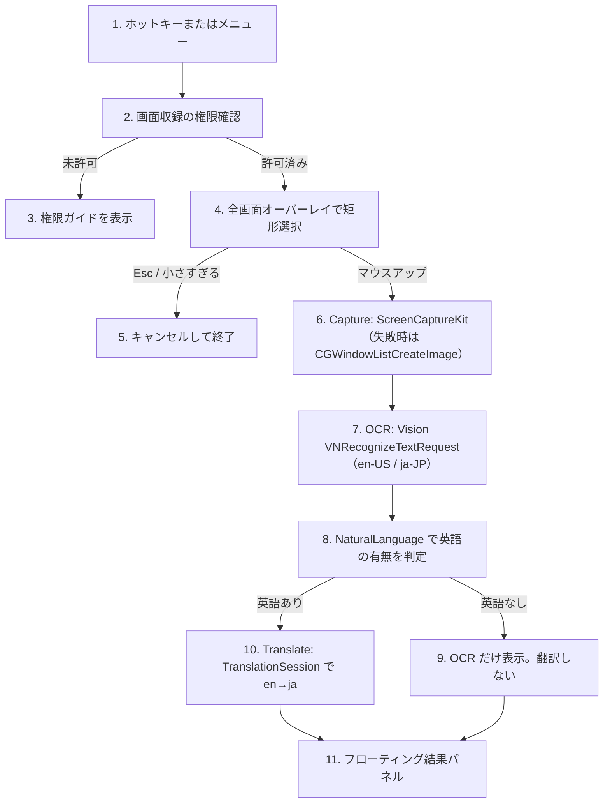

# ScreenRectTranslate

公開リポジトリ: https://github.com/c9katayama/ScreenRectTranslate

メニューバー常駐の macOS アプリです。グローバルホットキーで画面の矩形を選び、Vision で OCR したあと、Apple Translation で英語を日本語に翻訳します。個人利用向けのプロトタイプです。

## いまできること

1. メニューバーアイコン、またはデフォルトホットキー **⌥⇧T（Option + Shift + T）** で範囲選択を開始します。
2. 画面が暗くなります。ドラッグして範囲を選びます。Esc でキャンセル、マウスを離すと確定します。
3. 選択範囲を ScreenCaptureKit で取り込みます。失敗時は `CGWindowListCreateImage` に倒します。
4. Vision `VNRecognizeTextRequest` で文字認識します（`en-US` / `ja-JP`）。
5. NaturalLanguage で英語の有無を判定します。英語がなければ OCR 結果だけを出し、翻訳はしません。
6. 英語があれば Apple Translation（`TranslationSession`）で英語 → 日本語に訳します。オンデバイスで、API キーは不要です。
7. フローティングパネルに原文と訳文を出します。コピーボタン、Esc、パネル外クリックで閉じます。

ホットキーはメニューの「環境設定…」から変更できます。修飾キー（⌘ / ⌥ / ⌃ / ⇧）を 1 つ以上含めてください。

## 必要環境

- Apple Silicon の Mac
- macOS 15 Sequoia 以上（Apple Translation framework のため）
- Xcode 16 以上
- インターネット（初回だけ。翻訳言語データのダウンロード用）

Linux 上ではビルドできません。Xcode で Mac から開いてください。

## 開き方と実行

1. このリポジトリを clone します。

```bash
git clone https://github.com/c9katayama/ScreenRectTranslate.git
```

2. `ScreenRectTranslate.xcodeproj` を Xcode で開きます。
3. スキーム `ScreenRectTranslate`、実行先は自分の Mac を選びます。
4. Signing & Capabilities で自分の Team を選びます。Personal Team で構いません。サンドボックスはオフです。
5. Run（⌘R）します。Dock には出ず、メニューバー右側に `text.viewfinder` アイコンが出ます。

コマンドライン例:

```bash
xcodebuild -scheme ScreenRectTranslate -configuration Debug -destination 'platform=macOS,arch=arm64' build
xcodebuild -scheme ScreenRectTranslate -configuration Debug -destination 'platform=macOS,arch=arm64' test
```

署名の Team や証明書を変えると、画面収録・アクセシビリティの許可が別アプリ扱いになります。その場合は許可をやり直してください。

## 権限

初回は次を許可してください。メニューの「権限の確認…」からシステム設定へジャンプできます。

### 画面収録（必須）

選択範囲の画像を取るために必要です。許可しないと取り込みに失敗します。

1. アプリを一度起動し、範囲選択を試すか「権限の確認」から画面収録を開きます。
2. システム設定 → プライバシーとセキュリティ → 画面収録 で ScreenRectTranslate をオンにします。
3. アプリを再起動します。許可は再起動後に有効になることがあります。

### アクセシビリティ（推奨）

ホットキー本体は Carbon の `RegisterEventHotKey` なので、アクセシビリティなしでも登録できます。結果パネルをパネル外クリックで閉じるなど、一部操作で必要になることがあります。不安定なときは許可してください。許可後は再起動してください。

## 翻訳言語のダウンロード（初回）

- 英語 → 日本語の言語データが未導入のとき、`TranslationSession.prepareTranslation()` がシステムのダウンロード確認を出します。
- メニューまたは環境設定の「翻訳言語を準備」で、翻訳の前にダウンロードだけできます。
- ダウンロード中は翻訳できません。完了してからもう一度範囲選択してください。
- 言語データはシステム全体で共有されます。Translate アプリ側で言語を入れる方法でも使えます。

## 処理の流れとコード配置



- ホットキー: `Hotkey/HotkeyManager.swift`
- 矩形選択: `Overlay/SelectionOverlayController.swift`
- 画面取り込み: `Capture/ScreenCaptureService.swift` と `Capture/Geometry.swift`
- OCR: `OCR/OCRService.swift`
- 英語判定: `OCR/LanguageDetector.swift`
- 翻訳: `Translate/TranslationService.swift`
- 結果 UI: `UI/ResultPanelView.swift` と `UI/ResultPanelController.swift`
- 全体の順序: `App/AppCoordinator.swift`

## 実行時の注意

- macOS 15 未満では Apple Translation が使えません。
- OCR 品質は Vision 依存です。小さい文字、低コントラスト、装飾フォントは崩れます。
- DRM 保護画面は黒または空画像になることがあります。
- Retina は論理ポイントとピクセルを変換していますが、特殊な配置の複数ディスプレイではズレる可能性があります。
- 英語が含まれない選択（日本語だけなど）では翻訳しません。OCR 結果だけを表示します。
