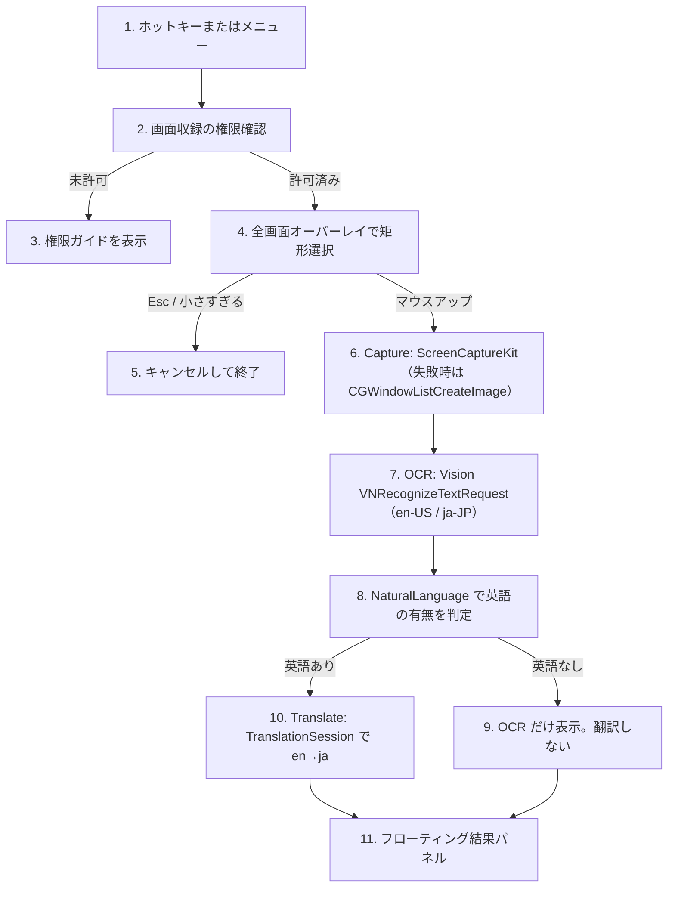

# ScreenRectTranslate

公開リポジトリ: https://github.com/c9katayama/ScreenRectTranslate

メニューバー常駐の macOS アプリです。グローバルホットキーで画面の矩形を選び、Vision で OCR したあと、Apple Translation で英語を日本語に翻訳します。個人利用向けのプロトタイプで、App Store 配布は対象外です。

クラウド翻訳（Gemini など）やローカル LLM（Ollama）は v1 には入れていません。将来のフォールバック候補として残しています。

## 必要環境

- MacBook Pro など Apple Silicon の Mac
- macOS 15 Sequoia 以上（Apple Translation framework のため）
- Xcode 16 以上
- インターネット（初回だけ。翻訳言語データのダウンロード用）

このリポジトリを Linux 上でビルドすることはできません。Xcode で Mac 上から開いてください。

## 開き方とビルド

1. `ScreenRectTranslate.xcodeproj` を Xcode で開きます。
2. スキーム `ScreenRectTranslate`、実行先は自分の Mac を選びます。
3. Signing & Capabilities で自分の Team を選びます。Personal Team で構いません。サンドボックスはオフです。
4. Run（⌘R）します。Dock には出ず、メニューバー右側に `text.viewfinder` アイコンが出ます。
5. コマンドライン例:

```bash
xcodebuild -scheme ScreenRectTranslate -configuration Debug -destination 'platform=macOS,arch=arm64' build
xcodebuild -scheme ScreenRectTranslate -configuration Debug -destination 'platform=macOS,arch=arm64' test
```

署名の Team や証明書を変えると、画面収録・アクセシビリティの許可が別アプリ扱いになります。その場合は許可をやり直してください。

## 使い方

1. メニューバーアイコン、またはデフォルトホットキー **⌥⇧T（Option + Shift + T）** を押します。
2. 画面が暗くなります。ドラッグして範囲を選びます。Esc でキャンセル、マウスを離すと確定します。
3. 選択範囲を取り込み、Vision で文字認識します。
4. 英語が含まれていれば Apple Translation で日本語に訳します。英語がなければ OCR 結果だけを出し、翻訳はしません。
5. フローティングパネルに原文と訳文が出ます。コピーボタン、Esc、パネル外クリックで閉じます。

ホットキーはメニューの「環境設定…」から変更できます。修飾キー（⌘ / ⌥ / ⌃ / ⇧）を 1 つ以上含めてください。

## 権限

初回は次の 2 つを許可してください。メニューの「権限の確認…」からシステム設定へジャンプできます。

### 画面収録（必須）

選択範囲の画像を取るために必要です。許可しないと取り込みに失敗します。

1. アプリを一度起動し、範囲選択を試すか「権限の確認」から画面収録を開きます。
2. システム設定 → プライバシーとセキュリティ → 画面収録 で ScreenRectTranslate をオンにします。
3. **アプリを再起動します。** 許可は再起動後に有効になることがあります。

### アクセシビリティ（推奨）

ホットキー本体は Carbon の `RegisterEventHotKey` なので、アクセシビリティなしでも登録できます。結果パネルをパネル外クリックで閉じるなど、一部操作で必要になることがあります。不安定なときは許可してください。許可後は再起動してください。

## 翻訳言語のダウンロード（初回）

翻訳はオンデバイスです。API キーは不要です。

- 英語 → 日本語の言語データが未導入のとき、`TranslationSession.prepareTranslation()` がシステムのダウンロード確認を出します。
- メニューまたは環境設定の「翻訳言語を準備」で、翻訳の前にダウンロードだけできます。
- ダウンロード中は翻訳できません。完了してからもう一度範囲選択してください。
- 言語データはシステム全体で共有されます。Translate アプリ側で言語を入れる方法でも使えます。

## 処理の流れ

コード上もこの順で分かれています。



| 工程 | 担当 |
| --- | --- |
| ホットキー | `Hotkey/HotkeyManager.swift` |
| 矩形選択 | `Overlay/SelectionOverlayController.swift` |
| 画面取り込み | `Capture/ScreenCaptureService.swift` + `Capture/Geometry.swift` |
| OCR | `OCR/OCRService.swift` |
| 英語判定 | `OCR/LanguageDetector.swift` |
| 翻訳 | `Translate/TranslationService.swift` |
| 結果 UI | `UI/ResultPanelView.swift` + `UI/ResultPanelController.swift` |
| 全体の順序 | `App/AppCoordinator.swift` |

## 制限事項（v1）

- **macOS 15 以上**と Apple Translation が前提です。14 以前では翻訳できません。
- OCR 品質は Vision 依存です。小さい文字、低コントラスト、装飾フォントは崩れます。
- Netflix など DRM 保護画面は黒または空画像になることがあります。
- Retina は論理ポイントとピクセルを変換していますが、特殊な配置の複数ディスプレイではズレる可能性があります。
- 英語以外 → 日本語は v1 の対象外です。日本語だけの選択は「翻訳しない」と出ます。
- クラウド翻訳やローカル LLM は入れていません。
- App Store 用のサンドボックス、公証、アイコン一式は未整備です。
- この開発環境（Linux）では実機実行できません。動作確認は MacBook 上で行ってください。

## ライセンス

個人利用のプロトタイプです。秘密情報や API キーは含まれません。
